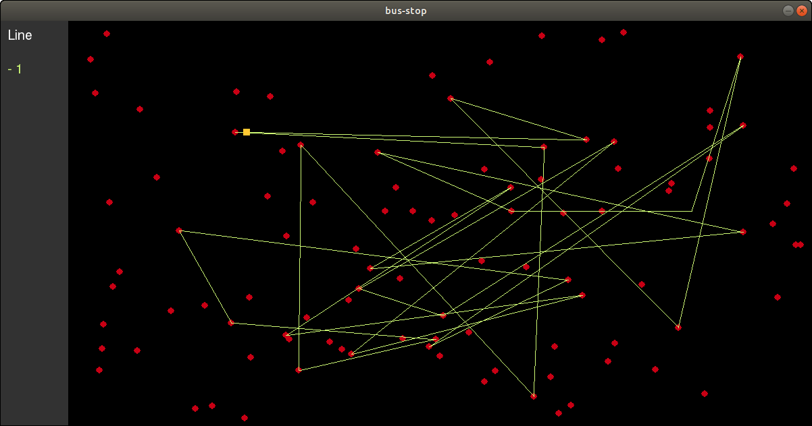

# BUS-STOP

Simple program for show all stops of a city and all bus that go from station to another.

**start with**
  - python3 simulation.py

**required**
  - python3
  - pygame for python3

**PROJECT NOT COMPLETED**
